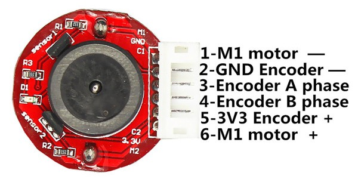

# Rotation
This monitor rotation stand is inspired by Istructables <a href="https://www.instructables.com/id/Motorized-Sit-or-Stand-Landscape-or-Portrait-Monit/">project</a> and based on <a href="https://www.arduino.cc/">Arduino</a>, <a href="https://www.autohotkey.com/">Autohotkey</a> and Noël Danjou <a href="http://noeld.com/programs.asp?cat=misc#Display">Display</a> programm. 

